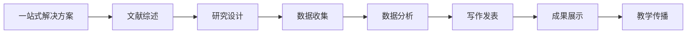

# AI4SocialScience 🎓

**社会科学研究的 AI 工具、论文与资源精选集**

[English](../index.md) | [中文](index.md)

---

## 🎯 关于本项目

**AI4SocialScience** 是专为社会科学学者、研究人员和学生打造的综合资源中心。我们不仅汇集了 **AI 技能**（工具），还整理了相关的 **学术论文**、**数据集** 和 **其他资源**，全方位支持您的研究工作流。

## 🔬 研究工作流

所有资源均按照典型的社会科学研究流程进行分类：

---

## 📚 分类浏览

### 🎯 一站式解决方案 (综合集成)
*覆盖研究多个阶段的综合工具。*

*   **[Claude Scientific Writer (Claude 科学写作助手)](https://github.com/K-Dense-AI/claude-scientific-writer)**: 端到端的学术论文写作解决方案。
*   *(更多资源即将推出)*

### 1️⃣ 文献综述与前期准备
*查找、整理和综合现有研究。*

*   **技能**: *(欢迎贡献)*
*   **论文**: *(欢迎贡献)*
*   **资源**: *(欢迎贡献)*

### 2️⃣ 研究设计与规划
*设计稳健的研究框架。*

*   **资源**:
    *   **[开放科学技能 (Open Science Skills)](https://github.com/scdenney/open-science-skills)**: 全面的开放科学实践和工作流。

### 3️⃣ 数据收集
*收集和管理研究数据。*

*   *(欢迎贡献)*

### 4️⃣ 数据分析
*分析定量和定性数据。*

*   *(欢迎贡献)*

### 5️⃣ 写作与发表
*撰写和发表研究成果。*

*   *(欢迎贡献)*

### 6️⃣ 成果展示与传播
*有效传播研究发现。*

*   *(欢迎贡献)*

### 7️⃣ 教学与教育
*支持教学和知识传播。*

*   *(欢迎贡献)*

---

## 🤝 参与贡献

我们欢迎您的贡献！请参阅我们的 [贡献指南](../guides/skill-development.md)（注：目前指南主要针对技能开发，但通用原则适用）。

## 📜 开源协议

MIT License.
