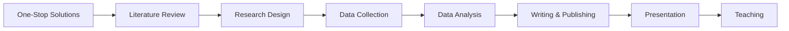

# AI4SocialScience 🎓

**A Curated Collection of AI Tools, Papers, and Resources for Social Science Research**

[English](index.md) | [中文](zh/index.md)

---

## 🎯 About

**AI4SocialScience** is a comprehensive hub designed for social science scholars, researchers, and students. We aggregate not just **AI Skills** (tools), but also relevant **Academic Papers**, **Datasets**, and **Resources** to support every stage of your research workflow.

## 🔬 Research Workflow

Everything is organized by the typical social science research process:

---

## 📚 Categories

### 🎯 One-Stop Solutions (Integrated)
*Tools that cover multiple stages of research.*

*   **[Claude Scientific Writer](https://github.com/K-Dense-AI/claude-scientific-writer)**: End-to-end academic paper writing solution.
*   *(More coming soon)*

### 1️⃣ Literature Review & Pre-Research
*Finding, organizing, and synthesizing research.*

*   **Skills**:
    *   *(Contributions welcome)*
*   **Papers**:
    *   *(Contributions welcome)*
*   **Resources**:
    *   *(Contributions welcome)*

### 2️⃣ Research Design & Planning
*Designing robust research frameworks.*

*   **Resources**:
    *   **[Open Science Skills](https://github.com/scdenney/open-science-skills)**: Comprehensive open science practices and workflows.

### 3️⃣ Data Collection
*Gathering and managing research data.*

*   *(Contributions welcome)*

### 4️⃣ Data Analysis
*Analyzing quantitative and qualitative data.*

*   *(Contributions welcome)*

### 5️⃣ Writing & Publishing
*Crafting and publishing research outputs.*

*   *(Contributions welcome)*

### 6️⃣ Presentation & Dissemination
*Communicating research findings effectively.*

*   *(Contributions welcome)*

### 7️⃣ Teaching & Pedagogy
*Supporting teaching and knowledge transfer.*

*   *(Contributions welcome)*

---

## 🤝 Contributing

We welcome contributions! Please see our [Contribution Guide](guides/skill-development.md) (Note: Guide currently focuses on skills, but general principles apply).

## 📜 License

MIT License.
